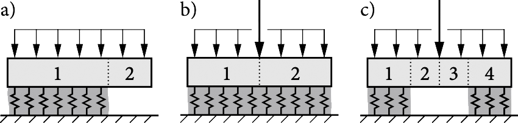

<!-- LOGO AND TITLE-->
<p align="right"></p>

# WEAC &nbsp;·&nbsp; Weak Layer Anticrack Nucleation Model

<!-- PROJECT SHIELDS -->
<!-- PyPI Version /pypi/v/:packageName -->
<!-- PyPI Downloads /pypi/:period/:packageName -->
<!-- PyPI Versions /pypi/pyversions/:packageName -->
[![Weac][weac-shield]][weac-url]
[![Release][release-shield]][release-url]
[![Contributors][contributors-shield]][contributors-url]
[![Stargazers][stars-shield]][stars-url]
[![Forks][forks-shield]][forks-url]
[![Issues][issues-shield]][issues-url]
[](https://zenodo.org/badge/latestdoi/203163531)\
Implementation of closed-form analytical models for the analysis of dry-snow slab avalanche release.

[View Demo](https://github.com/2phi/weac/blob/main/demo/demo.ipynb) · 
[Report Bug](https://github.com/2phi/weac/issues) · 
[Request Feature](https://github.com/2phi/weac/issues)

<!-- TABLE OF CONTENTS -->
## Contents
1. [About the project](#about-the-project)
2. [Installation](#installation)
3. [Usage](#usage)
4. [Roadmap](#roadmap)
5. [Release history](#release-history)
6. [How to contribute](#how-to-contribute)
7. [License](#license)
8. [Contact](#contact)

<!-- ABOUT THE PROJECT -->
## About the project

WEAC implements closed-form analytical models for the [mechanical analysis of dry-snow slabs on compliant weak layers](https://doi.org/10.5194/tc-14-115-2020), the [prediction of anticrack onset](https://doi.org/10.5194/tc-14-131-2020), and, in particular, allows for the analysis of stratified snow covers. The model covers propagation saw tests (a), and uncracked (b) or cracked (c) skier-loaded buried weak layers.



Please refer to the companion papers for model derivations, illustrations, dimensions, material properties, and kinematics:

- Rosendahl, P. L., & Weißgraeber, P. (2020). Modeling snow slab avalanches caused by weak-layer failure – Part 1: Slabs on compliant and collapsible weak layers. The Cryosphere, 14(1), 115–130. https://doi.org/10.5194/tc-14-115-2020
- Rosendahl, P. L., & Weißgraeber, P. (2020). Modeling snow slab avalanches caused by weak-layer failure – Part 2: Coupled mixed-mode criterion for skier-triggered anticracks. The Cryosphere, 14(1), 131–145. https://doi.org/10.5194/tc-14-131-2020

Written in [Python](https://www.python.org) and built with [Atom](https://atom.io), [GitKraken](https://www.gitkraken.com), and [Jupyter](https://jupyter.org). Note that [release v1.0](https://github.com/2phi/weac/releases/tag/v1.0.0) was written and built in [MATLAB](https://www.mathworks.com/products/matlab.html).

<!-- INSTALLATION -->
## Installation

Install globally using the `pip` Package Installer for Python
```sh
pip install weac
```
or clone the repo
```sh
git clone https://github.com/2phi/weac
```
for local use.

Needs
- [Numpy](https://numpy.org/) for matrix operations
- [Scipy](https://www.scipy.org/) for solving optimization problems
- [Pandas](https://pandas.pydata.org/) for data handling
- [Matplotlib](https://matplotlib.org/) for plotting

<!-- USAGE EXAMPLES -->
## Usage

_In preparation._ This space will show useful examples of how the package can be used. 
<!-- _For more examples, please refer to the [Documentation](https://example.com)._ -->


<!-- ROADMAP -->
## Roadmap

See the [open issues](https://github.com/2phi/weac/issues) for a list of proposed features and known issues.

### v2.2
- [ ] Finite fracture mechanics implementation for layered snow covers

### v2.1
- [ ] Flip coordinate system and order of layers of the slab
- [x] Allow for cutting PSTs from left or right side

### v2.0
- [x] Completely rewritten in Python
- [x] Displacement ODE soliver implemented
- [x] Stress analysis of arbitrarily layered snow slabs
- [x] FEM validation of
  - [x] displacements
  - [x] weak-layer stresses
  - [x] energy release rates in weak layers
- [ ] Documentation
- [ ] Demo and examples

## Release history

### v1.0

- Written in MATLAB
- Deformation analysis of homogeneous snow labs
- Weak-layer stress prediction
- Energy release rates of cracks in weak layers
- Finite fracture mechanics implementation
- Prediction of anticrack nucleation


<!-- CONTRIBUTING -->
## How to contribute

1. Fork the project
2. Create your feature branch (`git checkout -b feature/AmazingFeature`)
3. Commit your changes (`git commit -m 'Add some AmazingFeature'`)
4. Push to the branch (`git push origin feature/AmazingFeature`)
5. Open a pull request


<!-- LICENSE -->
## License

Copyright 2phi GbR, 2021.

We currently do not offer an open source license. Please contact us for private licensing options.

<!-- Do not forget to pick a license provide details in the `LICENSE` file. -->


<!-- CONTACT -->
## Contact

E-mail: mail@2phi.de · Web: https://2phi.de · Project Link: [https://github.com/2phi/weac](https://github.com/2phi/weac) · Project DOI: http://dx.doi.org/10.5281/zenodo.5773113


<!-- MARKDOWN LINKS & IMAGES -->
<!-- https://www.markdownguide.org/basic-syntax/#reference-style-links -->
[contributors-shield]: https://img.shields.io/github/contributors/2phi/weac.svg?style=flat&logo=github
[contributors-url]: https://github.com/2phi/weac/graphs/contributors
[forks-shield]: https://img.shields.io/github/forks/2phi/weac.svg?&color=blueviolet&style=flat&logo=github
[forks-url]: https://github.com/2phi/weac/network/members
[stars-shield]: https://img.shields.io/github/stars/2phi/weac.svg?style=flat&logo=github
[stars-url]: https://github.com/2phi/weac/stargazers
[issues-shield]: https://img.shields.io/github/issues/2phi/weac.svg?style=flat&logo=github
[issues-url]: https://github.com/2phi/weac/issues
[release-shield]: https://img.shields.io/github/v/release/2phi/weac.svg?display_name=tag&logo=data:image/png;base64,iVBORw0KGgoAAAANSUhEUgAAADIAAAAtCAYAAADsvzj/AAAACXBIWXMAAAsSAAALEgHS3X78AAAClUlEQVRoge1Z0W2DMBC9Vv0vGzQblE5QugEjZISMwAZNN2AEOkEzAtmAbkAmuMrSWbKezmBsC9IoT7KU4OPw8707G/PAzHQLeLwJFnciV4g7kWvDnci14WaIPCXeXxDRnohq51pHRC0RjYm+l8Gs7JGtYeaRdfTMXCT4tm0vviwGZm6ZeYe2sQ9oPQRcdAkESiCAGMUmiUjjcXxSrsdGIQR9KpEBHtKIjMoMRKZIjBJl1X+KrAYIL8ptzEiid/LCRZlCpJKGmka0C3PCVzhOTuEockZEa1p+uGTNAA7MXHvu9yV2D3YHp2/ITURL/hPYuESxdGr324FiCXfz85iTiCYpLI2ofbdvNyGpcoZwcvmdG8R+YhYH6POtR83MhGHEo4kUHl0fwA6j0cJEaBhBUoVS8rHYRBHxkdCqFNZ9N1q+3GhmnnXUxhVDBAenhloplQyJjrNsYaOhbVO8e7ilkdA07XOuLXC2r/aQsFGtlPxDyS0mspNBaTPoI6Hp2k10X5LXsFa4JLCKBRPBLXQIiVIGqVUzV35T2//FJEzTXqwKeTl6D3ip6pz/c/YWFRE9e/pe4f9F7Ps5p0iklMG9BAzoJdAOUQfancV2CLKGEGl7ppw4TMgKZbjoDTP08OGXiN6I6IGIPuR/DD4nZGXxJXJa9M6Pp/GDIpdvOWBAx7W00tH2WXz0kkOVonsfTD4Yf6eoKZqo/Z22FYhoWjlFdKmHFWt9H6mkiGiyOktUk7DWAZ2Ry9HT1+R4wJpfrExUfrQx5HC+9ZHpdy5HWxOJq1AK1iSyU651yrUobEnkN3j7EYAtpZUtGrQxkWz5QSsTwUXv30akcH5nK7sWW0jrIl+0siL109sSmJwwu2KzJcn7WY6I/gB+kRV89venQwAAAABJRU5ErkJggg==
[release-url]: https://github.com/2phi/weac/
[weac-shield]: https://img.shields.io/badge/weac-2.0-orange.svg?logo=data:image/png;base64,iVBORw0KGgoAAAANSUhEUgAAADIAAAAtCAYAAADsvzj/AAAACXBIWXMAAAsSAAALEgHS3X78AAAClUlEQVRoge1Z0W2DMBC9Vv0vGzQblE5QugEjZISMwAZNN2AEOkEzAtmAbkAmuMrSWbKezmBsC9IoT7KU4OPw8707G/PAzHQLeLwJFnciV4g7kWvDnci14WaIPCXeXxDRnohq51pHRC0RjYm+l8Gs7JGtYeaRdfTMXCT4tm0vviwGZm6ZeYe2sQ9oPQRcdAkESiCAGMUmiUjjcXxSrsdGIQR9KpEBHtKIjMoMRKZIjBJl1X+KrAYIL8ptzEiid/LCRZlCpJKGmka0C3PCVzhOTuEockZEa1p+uGTNAA7MXHvu9yV2D3YHp2/ITURL/hPYuESxdGr324FiCXfz85iTiCYpLI2ofbdvNyGpcoZwcvmdG8R+YhYH6POtR83MhGHEo4kUHl0fwA6j0cJEaBhBUoVS8rHYRBHxkdCqFNZ9N1q+3GhmnnXUxhVDBAenhloplQyJjrNsYaOhbVO8e7ilkdA07XOuLXC2r/aQsFGtlPxDyS0mspNBaTPoI6Hp2k10X5LXsFa4JLCKBRPBLXQIiVIGqVUzV35T2//FJEzTXqwKeTl6D3ip6pz/c/YWFRE9e/pe4f9F7Ps5p0iklMG9BAzoJdAOUQfancV2CLKGEGl7ppw4TMgKZbjoDTP08OGXiN6I6IGIPuR/DD4nZGXxJXJa9M6Pp/GDIpdvOWBAx7W00tH2WXz0kkOVonsfTD4Yf6eoKZqo/Z22FYhoWjlFdKmHFWt9H6mkiGiyOktUk7DWAZ2Ry9HT1+R4wJpfrExUfrQx5HC+9ZHpdy5HWxOJq1AK1iSyU651yrUobEnkN3j7EYAtpZUtGrQxkWz5QSsTwUXv30akcH5nK7sWW0jrIl+0siL109sSmJwwu2KzJcn7WY6I/gB+kRV89venQwAAAABJRU5ErkJggg==
[weac-url]: https://github.com/2phi/weac/
