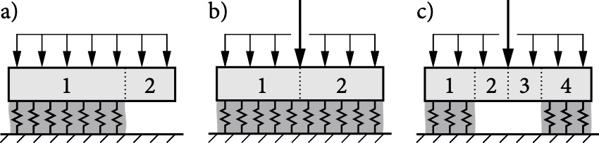

<!-- PROJECT LOGO -->


# **WEAC** &nbsp;·&nbsp; **We**ak Layer **A**nti**c**rack Nucleation Model

<!-- PROJECT SHIELDS -->
<!-- [![Weac][weac-shield]][weac-url]
[![Release][release-shield]][release-url] -->
[![Contributors][contributors-shield]][contributors-url]
[![Forks][forks-shield]][forks-url]
[![Stargazers][stars-shield]][stars-url]
[![Issues][issues-shield]][issues-url]

Implementation of closed-form analytical models for the analysis for dry-snow slab avalanche release.

[View Demo](https://github.com/2phi/weac) · 
[Report Bug](https://github.com/2phi/weac) · 
[Request Feature](https://github.com/2phi/weac)

<!-- TABLE OF CONTENTS -->
## Table of Contents
1. [About the project](#about-the-project)
2. [Installation](#installation)
3. [Usage](#usage)
4. [Roadmap](#roadmap)
5. [License](#license)
6. [Contact](#contact)

<!-- ABOUT THE PROJECT -->
## About the project

WEAC implements closed-form analytical models for the [mechanical analysis of dry-snow slabs on compliant weak layers](https://doi.org/10.5194/tc-14-115-2020), the [prediction of anticrack onset](https://doi.org/10.5194/tc-14-131-2020), and, in particular, allwos for stratified snow covers. The model covers propagation saw tests (a), and uncracked (b) or cracked (c) skier-loaded buried weak layers.



Please refer to the companion papers for model derivations, illustrations, dimensions, material properties, and kinematics:

- Rosendahl, P. L., & Weißgraeber, P. (2020). Modeling snow slab avalanches caused by weak-layer failure – Part 1: Slabs on compliant and collapsible weak layers. The Cryosphere, 14(1), 115–130. https://doi.org/10.5194/tc-14-115-2020
- Rosendahl, P. L., & Weißgraeber, P. (2020). Modeling snow slab avalanches caused by weak-layer failure – Part 2: Coupled mixed-mode criterion for skier-triggered anticracks. The Cryosphere, 14(1), 131–145. https://doi.org/10.5194/tc-14-131-2020

<!-- INSTALLATION -->
## Installation

This is an example of how you may give instructions on setting up your project locally.
To get a local copy up and running follow these simple example steps.

1. Clone the repo
   ```sh
   git clone https://github.com/your_username_/Project-Name.git
   ```
2. Install NPM packages
   ```sh
   npm install
<!-- USAGE EXAMPLES -->
## Usage

Use this space to show useful examples of how a project can be used. Additional screenshots, code examples and demos work well in this space. You may also link to more resources.

_For more examples, please refer to the [Documentation](https://example.com)._


<!-- ROADMAP -->
## Roadmap

See the [open issues](https://github.com/2phi/weac/issues) for a list of proposed features (and known issues).


<!-- CONTRIBUTING -->
## Contributing

Contributions are what make the open source community such an amazing place to be learn, inspire, and create. Any contributions you make are **greatly appreciated**.

1. Fork the Project
2. Create your Feature Branch (`git checkout -b feature/AmazingFeature`)
3. Commit your Changes (`git commit -m 'Add some AmazingFeature'`)
4. Push to the Branch (`git push origin feature/AmazingFeature`)
5. Open a Pull Request


<!-- LICENSE -->
## License

We currently do not offer an open source license. Please contact us for private licensing options.
Do not forget to pick a license provide details in the `LICENSE` file.


<!-- CONTACT -->
## Contact

E-mail: mail@2phi.de · Web: https://2phi.de · Project Link: [https://github.com/2phi/weac](https://github.com/2phi/weac)


<!-- MARKDOWN LINKS & IMAGES -->
<!-- https://www.markdownguide.org/basic-syntax/#reference-style-links -->
[contributors-shield]: https://img.shields.io/github/contributors/2phi/weac.svg?style=flat&logo=github
[contributors-url]: https://github.com/2phi/weac/graphs/contributors
[forks-shield]: https://img.shields.io/github/forks/2phi/weac.svg?&color=blueviolet&style=flat&logo=github
[forks-url]: https://github.com/2phi/weac/network/members
[stars-shield]: https://img.shields.io/github/stars/2phi/weac.svg?style=flat&logo=github
[stars-url]: https://github.com/2phi/weac/stargazers
[issues-shield]: https://img.shields.io/github/issues/2phi/weac.svg?style=flat&logo=github
[issues-url]: https://github.com/2phi/weac/issues
[release-shield]: https://img.shields.io/github/v/release/2phi/weac.svg?display_name=tag&logo=data:image/png;base64,iVBORw0KGgoAAAANSUhEUgAAANIAAAC8CAYAAAANZ/BoAAAACXBIWXMAAC4jAAAuIwF4pT92AAANaElEQVR4nO2d/3EbRxKFh1f3v/YiEByBoQiMi+DgCAxFcFAEJiM4MQKTERiM4IgITERgIgMiAl7B7KVWe1hgZ/r17Px4X5WrpDK1GO7gTfd09/Rcvb6+OkKIjr/x/RGih0IiBACFRAgACokQABQSIQAoJEIAUEiEAKCQCAFAIRECgEIiBACFRAgACokQABQSIQAoJEIAUEiEAKCQCAFAIRECgEIiBACFRAgACokQABQSIQAoJEIAUEiEAKCQCAFAIRECgEIiBACFRAgACokQABQSIQAoJEIAUEiEAKCQCAFAIRECgEIiBACFRAgACokQABQSIQAoJEIA/J0v8Sxz59xC/ps5534c+OGdc+7ZOffonNvIn0lFXL2+vnK+v+conpVzbumc+xj4jKOwvoqoXqwGStKBQvrGUTzrM1YnhIM88y7y70IiQyG9CehaYX3GsJXPocsXzqzjYi86Tzl6EE+dvz/K359ivu+ahTQX9+unSJ93kC/A04ifJW/MZAFaBS50e3Gv76zfe61COlqgXyf4XIppHDOZo1+Az2z3rSZudm1CamSFimWFTkExDdPIlx0poD572bdukA+tSUhz8Z8/JDCWnYyHfGMtVijW/DyIywiJqtaSkF0kJCInkcHrBMaRAm2w4D+R5+df8p1oEA+rwSIdV53fEhhHn4PsBWrOM021V+2yk4VWNQ+lW6Q2MpciH0TkNdJaoalF5MQ7UO+XShZSSnuiIWoU0krmBZn41vKT7NGCKdW1axKcrCH+UZF7d2cckdOgcrVLtUjXRiI6hk5vnXM/iwB+kOiPhhqid424cqmKyGld7RIt0nHj+F/wM+9lNX0c+P/PihKjLwnv4xDMZQ9iWYKFYi9WyZsSj1Egw8r38rxLNVuaECok/JooOexTu3wUIXnX6JXm2i1AVQvHItNPIwtN1xl9UWKynFBErQt+K3sfHxaeP/8XpQlJFXmRl/7Fo4SnYWL1JMcF6PcJRNTO30y+C2v5897jGUF71hItUii7gLwTrdH/M1UCfDswfy+eix2FpPhS38gL9PGNG4AFdGcCGDkyVQL8RhbRofkzP5dUe8+GQ8eX9wVljUrJIU0RWNjL/E1eSV+aRdp5/OxW/OcQEaGs0aGQ4xTNBCJ6OHE6dgiNyz+K0oQ01he+URYqoqxRCW7dFCK6FUs0dv6WxuMpTkgbyf0MsZOwtibShrJGrhAhHfdEMUuxPnu+/8ZzfEH7qRL3SG2ZR78c5V4mQLsnQR4+g57SnIB1xLKf0JPFvm4dhdShrTBuzf+58h4fjnuqf4PGuMu8q9BcDuPFQHM8n0JScmfQ6AL5vJx73TURram2x4Xv/ihISOxrN56lZOtR/JCxRdrIUW1rtCI6Ws0/PP/NVcgHsYn+OBpwonGbsYjWmYjIBRyL8Ckl+g4KaRxr8DGAXI9NzCLVFqJalvkKKXgfXXtlwxjm4N4Ce9D+Yt7z/zcRkrubSPkiRLXCMmCswZ9JIV0GHRTQruhDTS5/Rfdq62F16rjPZ1CENSTXF/y5DDacB90uKvgEpjCmF4VF88mZrNbW1ugWlOwOCTKo5oZ7pGHQLp0DVFSMaejyo0F3orsIItoCK0aiWiNHIQ1ikSfZKt1EH9cKWVu2itAr/QAc8yyw2kI13xTSab4aNOvQrLYLz4oKVB8IdNh/CJ8C1EuEjPdAIeFZGdSP3SgiQs2EVRAxmtrfAIt3F4E5LvX7ZbDheywOp2k3/yEBjy3gDM7RRfpT+YxLoAMjT4GRxU/acDst0jcag0211vefBQY8EG6StRVE7ouc4v7fHSL/RiF9484gT7JUlgKF7k+0rhKqrdk5xvQLHIum4gKyB6Rr98ba4EjAZ+WqrukYq3VVHo2FhHbpQserzeu9Q4v0ZjXQIroFuEahK+xeKaJlBGuEzHOtFeOFRSRrt0gWwYUHgO+vsUba6gBNH/Mx3AOFFFLB0AK96K1mi9QYFGHuQF8STQWEJh8Seg3/WA7A6gVt0hzRduCdmi1SaKh0CNQKp7FGB2Uy1toa3QCPYWj2cbC9UUutFgkdoTsg7iEVNBZNs0IvjEW0B4roTrmPQ1nFd2oU0leDyoU16CxQaJ1YiybsbX1gD/V8beXJ1qLfRG1CWgG7ALV8ASYvtfurUCFZ5432oHekbdB/sLq3tyYhWdyScA8u6tRM8l6R4LS+FBphjeaA+ftq1SujlmCDxXWYiHq2LtouRaFhZeuaOsTGHpGmsDjw+E4NFmlu4BPvDPpJa58X6talbo0QIjJz6VpKt0gWCddDwF1KY3hRjjO0T572c8+htUao+TO/8Lpki2QlonMXWoUS0vGmP66QMa2MzxtpAgyo+XuIcTixVCFZHIlwhpdaad260DFZu3WhX+CVlP5o528f4Xf8ixKFNLZJiC+oNlGnmGJ/NDMOed8HJqhR0dUD+Aj7WUoU0sZARMhcUZ85YOUNdessCbFG18AUBSpJPorSGkRqS0dOgc4V9UGE0FMTUsip0ztgxclN7D4XJQkJOREtyJL/IRBhdF/Xbm5cV+ez8KBd8ftI/cm/oxTXLlcROUCS8BDwb+BFmx18WlvNwSJCHWPxpgQhWYjoIaKItPujkH2A5eXEm5Eb/KWBiMxvLx8iZyG1LgFaRDFXNcTE+0altDmrS4yxRtdSDoUaxw54jCWIXPdIbdkP2s+PPSEIIflaJEtrdOnKmja/h7yoLGqYe4jcLFIjq9kfBYhoFunmuz7Wbt0Q7X4ILSKLShNvchLSSlZf9A0RrlPJHXNVQ4XUfb5E1m7dUMgZvR9ywFv9IKTs2jXyopbGX4BY0bmWmYgItTL7CsmKoTZg6DumXGoicokJaSYTvYiQ52iJKaK2Gyg6OOKDZVSr79bNjBLkyYnIJSCkVjyrSNcqdokloqWyiSEK68WpdessF4wkReQmFNLUq7O2nfAlZiJS6z5xPsSo0LDon96SrIjcBEJKwb2xqsOa0rqOwXJ/5IyCQC1Ji8hFFFIj7o3lyx4LsgB10QmIpCiellh7TguSF5GLJKSFWIAUJnLfOSbum3uYi9WZR7r2BMlkpTNKshCRiyAki9Cnho+9bkK7Xu7oWaxnt+0voh5uaiYp5FSyNzyRDMdKSFanVNH0x5eTlRnLLIN56DN57ZwvFpUNreuU2+SVinWQAU12InIGQkI1rSA4ctofPeQoIgcWEvK8PRnPub5xzUSFsSHcp1DFHQpKSHeJBRXIG7m4dTeZBkTeQQQbLE6okvGcu1gsByFZV5lEQSOk9urBEiNdOTEkpNTdumxyRGPQuHYWlb0ER8pBhl1JInIKIa0nXu0O4lcfG8dfOef+KRGfGhnqQpSqW/dQmoic4jYKyxsMLrHrnJbtszTq+Z06/ZsoNNfmW3Jr3ApsMkKEZHFp11jGJOusDpSlTHvR8XOnwj6lItX2fiL43a2pECKkqernfA/irWWsTA5PyzkPohhyaX7yJSDP8FVcnHujMZHL3Je4HzpFiJBiZp6PLsHPijNEzyLAT9IpiMThIPmhVa6VCr6EuHaxNrLtPa3InmVzcfmmTCBvpTK+bXzfyO9ZSlK7CleuT2jU7tl4M2sd3Wk6PRWsq9QPIprNhb7YFld1xqbYqNwlQoVkFXBoryq0uhnvFE2nDdgCsEC0/d2eepZnDKmGrS8xxbwlRaiQGrFKyNXzVgQ6tU/ddI6Vt5XVp6oEXjruS3t0/Qkw/tROFV8ilXmblFAhOVnFfwcMfhv7msIMeMrgYGT1VqiLJvy9UYaWt1LaU0V41JNl4AVisbjt7OmqxyktUovPMYr2NrfrFG4QSJwUgw878R4ooB4IITmxKkOFrLvOprvYEhEjUhJT7MsGsgIlpC5z2bC/0GWDkMK5L4roAhZCIjYspcIjdjHqDnBhdPGUcqt5DWwkHP858tmr6Fft5wgtUr6gLyw7xf5ClyIi0CLly7O4e5bV7QwOjYRCyp+1Yc6JYe6R0LUrg0ejqN5VjS8zBFqkMrCwHLU2kwmCQiqDc00iQ6Fb5wGFVAYWeR4GGjygkMgp9qyF9INCKgO0a0dr5AmFVAbos0vcH3nC8HcZoCeRYW9PaJHyB13Cw7B3ABRS/qCFxP1RABQS6cP9UQAUUv4gLdKOYe8wKKT8QQqJ1igQCol04f4oEAopf1DJ2AMtUjgUUv6g6uwoIgUUEmmhW6eAQiIttEgKWCKUP4gJZMstJbRIxNEa6aGQiJP+7UQBhZQ3iGTsga2l9VBIeYMQEqN1ACgkwv0RAAqJ0CIBoJDyRhuy3tV+9ysKCilvtHV2tEYgKKS6oZBAUEj1smfYGweFlDcLxegZrQNCIdUL3TogFFK90CIBoZDqZMuwNxYKKW9C80h068BQSHnzIXD0dOvA8GBf3oRMHm8qN4AWqT7o1hlAIeVLqFWhW2cAhZQvoUKiRTKAQqqLbe0vwAoKKV9CKr9ZW2cEhZQvITkkNjkxgkLKF1+L9ECLZAeFlC8+FunYKWhV+wuzhELKl7HW5SDHLVhbZwiFlC9jwth7ERFdOmMopHw5JlZvB0Z/tEI34v5RRBFgrV3+zEQwc3Hfnli9EB8KiRAtzrn/Aa0gJZFWX74lAAAAAElFTkSuQmCC
[release-url]: https://github.com/2phi/weac/
[weac-shield]: https://img.shields.io/badge/Weac-2.0-orange.svg?logo=data:image/png;base64,iVBORw0KGgoAAAANSUhEUgAAANIAAAC8CAYAAAANZ/BoAAAACXBIWXMAAC4jAAAuIwF4pT92AAANaElEQVR4nO2d/3EbRxKFh1f3v/YiEByBoQiMi+DgCAxFcFAEJiM4MQKTERiM4IgITERgIgMiAl7B7KVWe1hgZ/r17Px4X5WrpDK1GO7gTfd09/Rcvb6+OkKIjr/x/RGih0IiBACFRAgACokQABQSIQAoJEIAUEiEAKCQCAFAIRECgEIiBACFRAgACokQABQSIQAoJEIAUEiEAKCQCAFAIRECgEIiBACFRAgACokQABQSIQAoJEIAUEiEAKCQCAFAIRECgEIiBACFRAgACokQABQSIQAoJEIAUEiEAKCQCAFAIRECgEIiBACFRAgACokQABQSIQAoJEIA/J0v8Sxz59xC/ps5534c+OGdc+7ZOffonNvIn0lFXL2+vnK+v+conpVzbumc+xj4jKOwvoqoXqwGStKBQvrGUTzrM1YnhIM88y7y70IiQyG9CehaYX3GsJXPocsXzqzjYi86Tzl6EE+dvz/K359ivu+ahTQX9+unSJ93kC/A04ifJW/MZAFaBS50e3Gv76zfe61COlqgXyf4XIppHDOZo1+Az2z3rSZudm1CamSFimWFTkExDdPIlx0poD572bdukA+tSUhz8Z8/JDCWnYyHfGMtVijW/DyIywiJqtaSkF0kJCInkcHrBMaRAm2w4D+R5+df8p1oEA+rwSIdV53fEhhHn4PsBWrOM021V+2yk4VWNQ+lW6Q2MpciH0TkNdJaoalF5MQ7UO+XShZSSnuiIWoU0krmBZn41vKT7NGCKdW1axKcrCH+UZF7d2cckdOgcrVLtUjXRiI6hk5vnXM/iwB+kOiPhhqid424cqmKyGld7RIt0nHj+F/wM+9lNX0c+P/PihKjLwnv4xDMZQ9iWYKFYi9WyZsSj1Egw8r38rxLNVuaECok/JooOexTu3wUIXnX6JXm2i1AVQvHItNPIwtN1xl9UWKynFBErQt+K3sfHxaeP/8XpQlJFXmRl/7Fo4SnYWL1JMcF6PcJRNTO30y+C2v5897jGUF71hItUii7gLwTrdH/M1UCfDswfy+eix2FpPhS38gL9PGNG4AFdGcCGDkyVQL8RhbRofkzP5dUe8+GQ8eX9wVljUrJIU0RWNjL/E1eSV+aRdp5/OxW/OcQEaGs0aGQ4xTNBCJ6OHE6dgiNyz+K0oQ01he+URYqoqxRCW7dFCK6FUs0dv6WxuMpTkgbyf0MsZOwtibShrJGrhAhHfdEMUuxPnu+/8ZzfEH7qRL3SG2ZR78c5V4mQLsnQR4+g57SnIB1xLKf0JPFvm4dhdShrTBuzf+58h4fjnuqf4PGuMu8q9BcDuPFQHM8n0JScmfQ6AL5vJx73TURram2x4Xv/ihISOxrN56lZOtR/JCxRdrIUW1rtCI6Ws0/PP/NVcgHsYn+OBpwonGbsYjWmYjIBRyL8Ckl+g4KaRxr8DGAXI9NzCLVFqJalvkKKXgfXXtlwxjm4N4Ce9D+Yt7z/zcRkrubSPkiRLXCMmCswZ9JIV0GHRTQruhDTS5/Rfdq62F16rjPZ1CENSTXF/y5DDacB90uKvgEpjCmF4VF88mZrNbW1ugWlOwOCTKo5oZ7pGHQLp0DVFSMaejyo0F3orsIItoCK0aiWiNHIQ1ikSfZKt1EH9cKWVu2itAr/QAc8yyw2kI13xTSab4aNOvQrLYLz4oKVB8IdNh/CJ8C1EuEjPdAIeFZGdSP3SgiQs2EVRAxmtrfAIt3F4E5LvX7ZbDheywOp2k3/yEBjy3gDM7RRfpT+YxLoAMjT4GRxU/acDst0jcag0211vefBQY8EG6StRVE7ouc4v7fHSL/RiF9484gT7JUlgKF7k+0rhKqrdk5xvQLHIum4gKyB6Rr98ba4EjAZ+WqrukYq3VVHo2FhHbpQserzeu9Q4v0ZjXQIroFuEahK+xeKaJlBGuEzHOtFeOFRSRrt0gWwYUHgO+vsUba6gBNH/Mx3AOFFFLB0AK96K1mi9QYFGHuQF8STQWEJh8Seg3/WA7A6gVt0hzRduCdmi1SaKh0CNQKp7FGB2Uy1toa3QCPYWj2cbC9UUutFgkdoTsg7iEVNBZNs0IvjEW0B4roTrmPQ1nFd2oU0leDyoU16CxQaJ1YiybsbX1gD/V8beXJ1qLfRG1CWgG7ALV8ASYvtfurUCFZ5432oHekbdB/sLq3tyYhWdyScA8u6tRM8l6R4LS+FBphjeaA+ftq1SujlmCDxXWYiHq2LtouRaFhZeuaOsTGHpGmsDjw+E4NFmlu4BPvDPpJa58X6talbo0QIjJz6VpKt0gWCddDwF1KY3hRjjO0T572c8+htUao+TO/8Lpki2QlonMXWoUS0vGmP66QMa2MzxtpAgyo+XuIcTixVCFZHIlwhpdaad260DFZu3WhX+CVlP5o528f4Xf8ixKFNLZJiC+oNlGnmGJ/NDMOed8HJqhR0dUD+Aj7WUoU0sZARMhcUZ85YOUNdessCbFG18AUBSpJPorSGkRqS0dOgc4V9UGE0FMTUsip0ztgxclN7D4XJQkJOREtyJL/IRBhdF/Xbm5cV+ez8KBd8ftI/cm/oxTXLlcROUCS8BDwb+BFmx18WlvNwSJCHWPxpgQhWYjoIaKItPujkH2A5eXEm5Eb/KWBiMxvLx8iZyG1LgFaRDFXNcTE+0altDmrS4yxRtdSDoUaxw54jCWIXPdIbdkP2s+PPSEIIflaJEtrdOnKmja/h7yoLGqYe4jcLFIjq9kfBYhoFunmuz7Wbt0Q7X4ILSKLShNvchLSSlZf9A0RrlPJHXNVQ4XUfb5E1m7dUMgZvR9ywFv9IKTs2jXyopbGX4BY0bmWmYgItTL7CsmKoTZg6DumXGoicokJaSYTvYiQ52iJKaK2Gyg6OOKDZVSr79bNjBLkyYnIJSCkVjyrSNcqdokloqWyiSEK68WpdessF4wkReQmFNLUq7O2nfAlZiJS6z5xPsSo0LDon96SrIjcBEJKwb2xqsOa0rqOwXJ/5IyCQC1Ji8hFFFIj7o3lyx4LsgB10QmIpCiellh7TguSF5GLJKSFWIAUJnLfOSbum3uYi9WZR7r2BMlkpTNKshCRiyAki9Cnho+9bkK7Xu7oWaxnt+0voh5uaiYp5FSyNzyRDMdKSFanVNH0x5eTlRnLLIN56DN57ZwvFpUNreuU2+SVinWQAU12InIGQkI1rSA4ctofPeQoIgcWEvK8PRnPub5xzUSFsSHcp1DFHQpKSHeJBRXIG7m4dTeZBkTeQQQbLE6okvGcu1gsByFZV5lEQSOk9urBEiNdOTEkpNTdumxyRGPQuHYWlb0ER8pBhl1JInIKIa0nXu0O4lcfG8dfOef+KRGfGhnqQpSqW/dQmoic4jYKyxsMLrHrnJbtszTq+Z06/ZsoNNfmW3Jr3ApsMkKEZHFp11jGJOusDpSlTHvR8XOnwj6lItX2fiL43a2pECKkqernfA/irWWsTA5PyzkPohhyaX7yJSDP8FVcnHujMZHL3Je4HzpFiJBiZp6PLsHPijNEzyLAT9IpiMThIPmhVa6VCr6EuHaxNrLtPa3InmVzcfmmTCBvpTK+bXzfyO9ZSlK7CleuT2jU7tl4M2sd3Wk6PRWsq9QPIprNhb7YFld1xqbYqNwlQoVkFXBoryq0uhnvFE2nDdgCsEC0/d2eepZnDKmGrS8xxbwlRaiQGrFKyNXzVgQ6tU/ddI6Vt5XVp6oEXjruS3t0/Qkw/tROFV8ilXmblFAhOVnFfwcMfhv7msIMeMrgYGT1VqiLJvy9UYaWt1LaU0V41JNl4AVisbjt7OmqxyktUovPMYr2NrfrFG4QSJwUgw878R4ooB4IITmxKkOFrLvOprvYEhEjUhJT7MsGsgIlpC5z2bC/0GWDkMK5L4roAhZCIjYspcIjdjHqDnBhdPGUcqt5DWwkHP858tmr6Fft5wgtUr6gLyw7xf5ClyIi0CLly7O4e5bV7QwOjYRCyp+1Yc6JYe6R0LUrg0ejqN5VjS8zBFqkMrCwHLU2kwmCQiqDc00iQ6Fb5wGFVAYWeR4GGjygkMgp9qyF9INCKgO0a0dr5AmFVAbos0vcH3nC8HcZoCeRYW9PaJHyB13Cw7B3ABRS/qCFxP1RABQS6cP9UQAUUv4gLdKOYe8wKKT8QQqJ1igQCol04f4oEAopf1DJ2AMtUjgUUv6g6uwoIgUUEmmhW6eAQiIttEgKWCKUP4gJZMstJbRIxNEa6aGQiJP+7UQBhZQ3iGTsga2l9VBIeYMQEqN1ACgkwv0RAAqJ0CIBoJDyRhuy3tV+9ysKCilvtHV2tEYgKKS6oZBAUEj1smfYGweFlDcLxegZrQNCIdUL3TogFFK90CIBoZDqZMuwNxYKKW9C80h068BQSHnzIXD0dOvA8GBf3oRMHm8qN4AWqT7o1hlAIeVLqFWhW2cAhZQvoUKiRTKAQqqLbe0vwAoKKV9CKr9ZW2cEhZQvITkkNjkxgkLKF1+L9ECLZAeFlC8+FunYKWhV+wuzhELKl7HW5SDHLVhbZwiFlC9jwth7ERFdOmMopHw5JlZvB0Z/tEI34v5RRBFgrV3+zEQwc3Hfnli9EB8KiRAtzrn/Aa0gJZFWX74lAAAAAElFTkSuQmCC
[weac-url]: https://github.com/2phi/weac/
