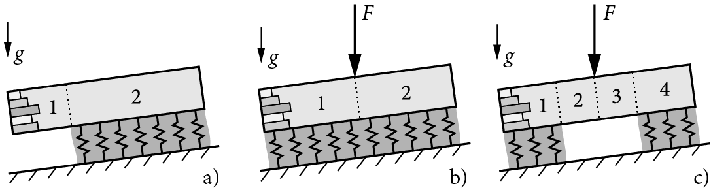

WEAC API Documentation
======================

**WEAC** (Weak Layer Anticrack Nucleation Model) is a Python implementation of closed-form analytical models for the analysis of dry-snow slab avalanche release.

.. raw:: html

   

      
      
      
   

What is WEAC?
-------------

WEAC implements closed-form analytical models for the `mechanical analysis of dry-snow slabs on compliant weak layers <https://doi.org/10.5194/tc-14-115-2020>`_, the `prediction of anticrack onset <https://doi.org/10.5194/tc-14-131-2020>`_, and allows for the `analysis of stratified snow covers <https://doi.org/10.5194/tc-17-1475-2023>`_.

The model covers:
- **Propagation saw tests** (a)
- **Skier-loaded weak layers** (b) 
- **Weak-layer crack nucleation** (c)

Installation
------------

Install globally using the `pip` Package Installer for Python:

.. code-block:: bash

   pip install -U weac

Or clone the repository for local use:

.. code-block:: bash

   git clone https://github.com/2phi/weac

Requirements:
- **Python** ≥ 3.12
- **Numpy** ≥ 2.0.1
- **Scipy** ≥ 1.14.0
- **Matplotlib** ≥ 3.9.1
- **Pydantic** ≥ 2.11.7
- **Snowpylot** ≥ 1.1.3

Quick Start
-----------

.. code-block:: python

   import weac
   
   # Create a scenario configuration
   scenario = weac.components.scenario_config.ScenarioConfig()
   
   # Run analysis
   results = weac.analysis.analyzer.Analyzer.analyze(scenario)

**🐙 View on GitHub:** `GitHub Repository <https://github.com/2phi/weac>`_

Key Features
------------

* **Closed-form analytical models** for snow slab mechanics
* **Weak layer analysis** with compliance and collapse modeling
* **Anticrack prediction** using mixed-mode failure criteria
* **Stratified snow cover** analysis capabilities
* **Python-native** implementation with comprehensive documentation
* **Jupyter notebook** support for interactive analysis
* **Multiple scenario types**: Skier loading, PST (Propagation Saw Test), and more
* **Advanced visualization** tools for deformations and stress analysis

Usage Examples
--------------

Basic usage involves creating snow layers, weak layers, and scenario configurations:

.. code-block:: python

   from weac.components import Layer, WeakLayer, ScenarioConfig, Segment
   from weac.core.system_model import SystemModel
   from weac.analysis.analyzer import Analyzer
   
   # Define snow layers (from top to bottom)
   layers = [
       Layer(rho=170, h=100),  # Surface layer
       Layer(rho=190, h=40),
       Layer(rho=230, h=130),
       Layer(rho=250, h=20),
       Layer(rho=210, h=70),
       Layer(rho=380, h=20),
       Layer(rho=280, h=100)   # Last slab layer above weak layer
   ]
   
   # Define weak layer
   weak_layer = WeakLayer(rho=125, h=20)
   
   # Create skier scenario
   skier_config = ScenarioConfig(system_type='skier', phi=30)
   skier_segments = [
       Segment(length=5000, has_foundation=True, m=0),
       Segment(length=0, has_foundation=False, m=80),  # 80kg skier
       Segment(length=0, has_foundation=False, m=0),
       Segment(length=5000, has_foundation=True, m=0),
   ]
   
   # Build and analyze system
   system = SystemModel(
       model_input=ModelInput(
           weak_layer=weak_layer,
           scenario_config=skier_config,
           layers=layers,
           segments=skier_segments,
       ),
       config=Config(touchdown=True)
   )
   
   # Analyze results
   analyzer = Analyzer(system)
   xsl, z, xwl = analyzer.rasterize_solution(mode="cracked")
   Gdif, GdifI, GdifII = analyzer.differential_ERR()

Documentation Structure
-----------------------

.. toctree::
   :maxdepth: 2
   :caption: Getting Started

   weac
   weac.components
   weac.core
   weac.analysis

.. toctree::
   :maxdepth: 2
   :caption: Utilities & Tools

   weac.utils
   weac.logging_config

.. toctree::
   :maxdepth: 2
   :caption: Examples & Reference

   modules

Research & Citations
--------------------

**Cite the software:**
Rosendahl, P. L., Schneider, J., & Weissgraeber, P. (2022). Weak Layer Anticrack Nucleation Model (WEAC). Zenodo. https://doi.org/10.5281/zenodo.5773113

**Key publications:**
- `A closed-form model for layered snow slabs <https://doi.org/10.5194/tc-17-1475-2023>`_ (Weißgraeber & Rosendahl, 2023)
- `Modeling snow slab avalanches caused by weak-layer failure <https://doi.org/10.5194/tc-14-115-2020>`_ (Rosendahl & Weißgraeber, 2020)

Support & Community
-------------------

* `Report bugs <https://github.com/2phi/weac/issues>`_
* `Request features <https://github.com/2phi/weac/issues>`_
* `View releases <https://github.com/2phi/weac/releases>`_
* `Download from PyPI <https://pypi.org/project/weac/>`_
* `View demo notebook <https://github.com/2phi/weac/blob/main/demo/demo.ipynb>`_

Getting Help
------------

* **Documentation**: This site provides comprehensive API documentation
* **Examples**: Check the modules section for usage examples
* **Demo**: Interactive Jupyter notebook with examples
* **Research Papers**: Refer to the publications listed above for theoretical background
* **GitHub**: Visit the repository for source code and issue tracking

**Need help?** Open an issue on GitHub or check the documentation structure below.

License
-------

WEAC is licensed under `CC BY-NC-SA 4.0 <https://creativecommons.org/licenses/by-nc-sa/4.0/>`_.

Contact
-------

* **Email**: mail@2phi.de
* **Web**: https://2phi.de
* **Project**: https://github.com/2phi/weac

Indices and tables
------------------

* :ref:`genindex`
* :ref:`modindex`
* :ref:`search`

.. |Version| image:: https://img.shields.io/github/v/release/2phi/weac.svg?display_name=tag&color=f99a44&style=flat-square&logo=data:image/png;base64,iVBORw0KGgoAAAANSUhEUgAAADIAAAAtCAYAAADsvzj/AAAACXBIWXMAAAsSAAALEgHS3X78AAAClUlEQVRoge1Z0W2DMBC9Vv0vGzQblE5QugEjZISMwAZNN2AEOkEzAtmAbkAmuMrSWbKezmBsC9IoT7KU4OPw8707G/PAzHQLeLwJFnciV4g7kWvDnci14WaIPCXeXxDRnohq51pHRC0RjYm+l8Gs7JGtYeaRdfTMXCT4tm0vviwGZm6ZeYe2sQ9oPQRcdAkESiCAGMUmiUjjcXxSrsdGIQR9KpEBHtKIjMoMRKZIjBJl1X+KrAYIL8ptzEiid/LCRZlCpJKGmka0C3PCVzhOTuEockZEa1p+uGTNAA7MXHvu9yV2D3YHp2/ITURL/hPYuESxdGr324FiCXfz85iTiCYpLI2ofbdvNyGpcoZwcvmdG8R+YhYH6POtR83MhGHEo4kUHl0fwA6j0cJEaBhBUoVS8rHYRBHxkdCqFNZ9N1q+3GhmnnXUxhVDBAenhloplQyJjrNsYaOhbVO8e7ilkdA07XOuLXC2r/aQsFGtlPxDyS0mspNBaTPoI6Hp2k10X5LXsFa4JLCKBRPBLXQIiVIGqVUzV35T2//FJEzTXqwKeTl6D3ip6pz/c/YWFRE9e/pe4f9F7Ps5p0iklMG9BAzoJdAOUQfancV2CLKGEGl7ppw4TMgKZbjoDTP08OGXiN6I6IGIPuR/DD4nZGXxJXJa9M6Pp/GDIpdvOWBAx7W00tH2WXz0kkOVonsfTD4Yf6eoKZqo/Z22FYhoWjlFdKmHFWt9H6mkiGiyOktUk7DWAZ2Ry9HT1+R4wJpfrExUfrQx5HC+9ZHpdy5HWxOJq1AK1iSyU651yrUobEnkN3j7EYAtpZUtGrQxkWz5QSsTwUXv30akcH5nK7sWW0jrIl+0siL109sSmJwwu2KzJcn7WY6I/gB+kRV89venQwAAAABJRU5ErkJggg==
   :target: https://github.com/2phi/weac/releases

.. |PyPI| image:: https://img.shields.io/pypi/v/weac.svg?logo=python&logoColor=white&color=f46b58&style=flat-square
   :target: https://pypi.org/project/weac/

.. |DOI| image:: https://img.shields.io/badge/DOI-10.5281/zenodo.5773113-f03a6d.svg?style=flat-square
   :target: https://zenodo.org/badge/latestdoi/203163531
